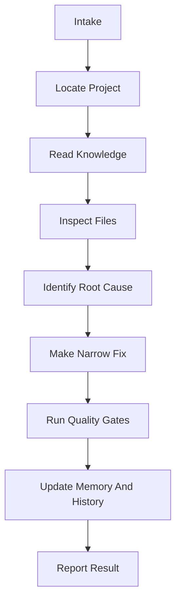

# Development Workflow

Use this workflow for every Salesforce task.

Codex must move from request intake to evidence-backed result. Do not skip project discovery, source inspection, Salesforce knowledge review, or Memory and History updates for meaningful work.

## Workflow At A Glance



## Checklist

| Step | Codex must do | Evidence produced |
| ---: | --- | --- |
| 1 | Intake | Clear task target, scope, and constraints. |
| 2 | Locate project | Confirmed real `force-app/main/default` path. |
| 3 | Read knowledge | Relevant Salesforce knowledge base docs identified and read. |
| 4 | Inspect files | Real project metadata inspected before editing. |
| 5 | Identify root cause | Explanation of why the issue exists. |
| 6 | Make narrow fix | Smallest safe file changes. |
| 7 | Run quality gates | Command output, static review, or clear validation limit. |
| 8 | Update Memory and History | Durable lessons and chronological record updated. |
| 9 | Report result | Root cause, fix, validation, files changed, assumptions, and limits. |

## 1. Intake

Before editing, identify:

- user goal,
- requested scope,
- Salesforce layer involved,
- whether the task is investigation, code, metadata, docs, tests, or deployment,
- constraints from the user,
- whether the request is audit-only or implementation.

If the user asks for a review, use a review posture: findings first, ordered by severity, with file references.

## 2. Locate Project

Find the real Salesforce DX source root.

Useful searches:

```powershell
rg --files -g sfdx-project.json
rg --files -g package.xml
Get-ChildItem -Path FORCE_APP_DIRECTORY -Recurse -Directory -Filter default
```

Confirm a target only when it is the real project metadata path:

```text
force-app/main/default/
```

If several candidates exist, inspect project names, `sfdx-project.json`, folder context, and the user request. Ask before editing if the target remains ambiguous.

For broad or unfamiliar work, use:

- `SALESFORCE_KNOWLEDGE/REFERENCE/project-discovery-template.md`
- `SALESFORCE_KNOWLEDGE/CHECKLISTS/project-discovery.md`

## 3. Read Knowledge

Use `SALESFORCE_KNOWLEDGE/INDEX.md` to choose task-specific docs.

| Work type | Start here |
| --- | --- |
| Apex | `SALESFORCE_KNOWLEDGE/GUIDES/SALESFORCE_APEX_GUIDE.md` |
| LWC | `SALESFORCE_KNOWLEDGE/GUIDES/SALESFORCE_LWC_GUIDE.md` |
| Aura | `SALESFORCE_KNOWLEDGE/GUIDES/SALESFORCE_AURA_GUIDE.md` |
| Visualforce | `SALESFORCE_KNOWLEDGE/GUIDES/SALESFORCE_VISUALFORCE_GUIDE.md` |
| Metadata | `SALESFORCE_KNOWLEDGE/GUIDES/SALESFORCE_METADATA_GUIDE.md` |
| Record pages | `SALESFORCE_KNOWLEDGE/GUIDES/SALESFORCE_RECORD_PAGE_GUIDE.md` |
| Deployment | `SALESFORCE_KNOWLEDGE/GUIDES/SALESFORCE_DEPLOYMENT_GUIDE.md` |
| Testing | `SALESFORCE_KNOWLEDGE/GUIDES/SALESFORCE_TESTING_GUIDE.md` |
| Salesforce Files | `SALESFORCE_KNOWLEDGE/GUIDES/SALESFORCE_FILE_HANDLING_GUIDE.md` |
| Mobile | `SALESFORCE_KNOWLEDGE/GUIDES/SALESFORCE_MOBILE_GUIDE.md` |
| Debugging | `SALESFORCE_KNOWLEDGE/GUIDES/SALESFORCE_COMMON_FAILURES_AND_FIXES.md` |

Also check relevant patterns, checklists, Memory, and History.

For code changes, also check:

- `SALESFORCE_KNOWLEDGE/COMMANDS/`
- `SALESFORCE_KNOWLEDGE/PARAMETERS/`
- `SALESFORCE_KNOWLEDGE/QUALITY_STRATEGIES/`
- `SALESFORCE_KNOWLEDGE/VALIDATION_FLOWS/`
- `TOOLS/`
- `QUALITY_GATES/`
- `AUTOMATION/`

If public examples or external repo lessons are useful, also read `SALESFORCE_KNOWLEDGE/REFERENCE/EXTERNAL_PATTERN_USAGE_RULES.md`. External intelligence can inform original guidance, but it must not be copied into source, metadata, configs, workflow files, data, or sample names.

## 4. Inspect Files

Search and read before editing.

```powershell
rg "ErrorTextOrSymbol" <project-root>
rg --files <project-root>
```

Do not edit from memory, prompt text, generated examples, or external repo patterns alone. Verify the current project files first.

| Change type | Inspect |
| --- | --- |
| Apex service | Service, controller callers, triggers, tests, referenced metadata |
| Apex trigger | Trigger, handler, services, recursion guards, tests |
| LWC | `.html`, `.js`, `.css`, `.js-meta.xml`, Apex controller, parent components |
| Aura | Component, controller, helper, renderer, design, documentation |
| Visualforce | Page, controller or extension, static resources, tests |
| Object or field metadata | Object XML, field XML, layouts, FlexiPages, permissions, Apex and LWC references |
| Permission work | Permission sets, profiles if present, object/field metadata, tabs, classes, pages |

## 5. Identify Root Cause

Do not patch symptoms blindly.

Root cause should explain:

- what failed,
- where the failure is introduced,
- why Salesforce behaves that way,
- which existing project pattern applies,
- what the smallest safe correction is.

If local evidence is not enough, state the gap and ask for the missing data.

## 6. Make Narrow Fix

Rules:

- Edit only required files.
- Preserve existing naming and structure.
- Keep Salesforce metadata pairs together.
- Keep LWC bundle files together.
- Keep tests aligned to changed behavior.
- Avoid unrelated formatting.
- Avoid broad deploy payloads.
- Do not invent deployable metadata or unverified Salesforce names.
- Do not over-refactor, broadly reformat, or rewrite unrelated files.
- Do not copy external repo source, sample metadata, configs, workflow files, data, or sample names.

## 7. Run Quality Gates

Choose validation based on the change and the tools available in the real project.

| Change | Useful validation |
| --- | --- |
| Apex | Focused Apex tests, Salesforce Code Analyzer if available, deployment dry run with specified tests |
| LWC | LWC Jest, LWC ESLint, Salesforce Code Analyzer if configured, bundle deploy dry run, template syntax inspection |
| Mobile LWC | Mobile lint if configured, mobile checklist, LWC tests, static inspection |
| Metadata | Narrow deploy dry run, XML reference inspection, deployment checklist |
| Visualforce | Controller tests, deploy dry run, PDF behavior checklist if relevant |
| Docs only | Markdown link check, public-safety scan, path consistency scan |

Do not claim validation succeeded unless the exact command or check actually ran and passed. If validation cannot run, report it as skipped with the reason. Static inspection is useful evidence, but it is not a substitute for test, lint, analyzer, deploy, retrieve, or runtime pass claims.

Local helper scripts live in `AUTOMATION/`. They are public-safe and should not install packages or change project dependencies.

Before running a command, match it to the relevant command map and parameter map:

| Need | Read |
| --- | --- |
| Apex validation | `SALESFORCE_KNOWLEDGE/COMMANDS/APEX_VALIDATION_COMMAND_MAP.md` |
| LWC tests | `SALESFORCE_KNOWLEDGE/COMMANDS/LWC_TEST_COMMAND_MAP.md` |
| Salesforce CLI deploy/test | `SALESFORCE_KNOWLEDGE/COMMANDS/SALESFORCE_CLI_COMMAND_MAP.md` |
| NPM scripts | `SALESFORCE_KNOWLEDGE/COMMANDS/NPM_SCRIPT_COMMAND_MAP.md` |
| Tool options | `SALESFORCE_KNOWLEDGE/PARAMETERS/` |
| Task sequence | `SALESFORCE_KNOWLEDGE/VALIDATION_FLOWS/` |

### Salesforce Code Analyzer Gate

After Apex, LWC, Aura, metadata, Flow, static resource, or deployment-scope changes:

1. Check [TOOLS/SALESFORCE_CODE_ANALYZER.md](../TOOLS/SALESFORCE_CODE_ANALYZER.md).
2. Check [QUALITY_GATES/CODE_ANALYZER_RULES.md](../QUALITY_GATES/CODE_ANALYZER_RULES.md).
3. Run from the real Salesforce DX project root when available:

```bash
sf code-analyzer run --target force-app/main/default --view table
```

If the analyzer is missing, report:

```text
SKIPPED: Salesforce Code Analyzer was not run because sf code-analyzer was not installed or not available on PATH.
```

Record the command, target, and result in `HISTORY/CODEX_RUN_LOG.md`; use `HISTORY/TEST_RESULTS_LOG.md` when the analyzer is part of a validation/test pass.

## 8. Update Memory And History

After meaningful work:

1. Add reusable lessons to Memory.
2. Add chronological task facts to History.
3. Record deployment or test results in specialized History files when relevant.
4. Keep private data out of all logs.
5. Generalize private-derived lessons before recording them.
6. Record skipped validation gates with exact reasons instead of implying success.

## 9. Report Result

Final response should include:

- root cause or reason for the change,
- fix summary,
- validation commands and results,
- files changed,
- assumptions and limits.

Keep the response concise and evidence-based.
