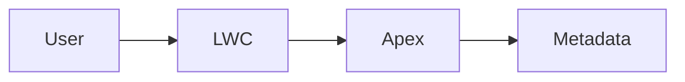

# Output Format Rules

Codex final responses must be evidence-based and useful to the user.

## Required Final Response Content

Every implementation or investigation result should include:

| Item | Required content |
| --- | --- |
| Root cause | What caused the issue or why the change was needed. |
| Fix summary | What changed and why. |
| Files changed | List changed files. |
| Validation | Commands run, checks performed, and results. |
| Assumptions and limits | Anything not verified or any known constraints. |

Do not claim success without evidence.

Use strict validation terms:

| Term | Meaning |
| --- | --- |
| Passed | The exact command or check ran and succeeded. |
| Failed | The exact command or check ran and failed. |
| Skipped | The check did not run, and the reason is stated. |
| Static review only | Files were inspected, but no runtime, org, deploy, test, lint, analyzer, retrieve, or GitHub check passed. |

Never describe tests, lint, Salesforce Code Analyzer, deploys, retrieves, quick deploys, GitHub checks, or runtime behavior as passing unless they actually ran and passed.

## When Code Is Changed

When code is changed, provide:

- root cause,
- fix summary,
- validation commands/results,
- files changed,
- assumptions and limits,
- full updated files or clear file references.

For large files, do not paste excessive full content unless the user explicitly asks. Instead, provide clickable file references and describe the changed sections.

If the user explicitly asks for full updated files, include full file content for changed code files.

## Validation Reporting

Good validation reporting:

```text
Validation:
- `sf apex run test --tests MyServiceTest --target-org dev --result-format human --wait 30` passed.
- Inspected `myComponent.js-meta.xml`; target exposure still matches the original record page use.
```

If validation could not run:

```text
Validation:
- Not run. No Salesforce org alias is configured in this workspace.
- Static inspection completed for the changed files and direct callers.
```

If only static inspection was performed, say that directly. Do not summarize static inspection as a passed test, passed lint, passed analyzer, or successful deploy.

Never write:

```text
All good.
Should work.
Validated mentally.
```

## Files Changed Format

Use concise bullets:

```text
Files changed:
- `force-app/main/default/classes/MyService.cls`
- `force-app/main/default/classes/MyServiceTest.cls`
- `MEMORY/PROJECT_MEMORY.md`
- `HISTORY/TASK_HISTORY.md`
```

## Root Cause Format

Root cause should be specific:

```text
Root cause: `myComponent.html` used a JavaScript expression in an LWC template. LWC templates only allow simple property access, so deployment failed at compile time.
```

Avoid vague statements:

```text
Root cause: Salesforce issue.
```

## Fix Summary Format

Fix summary should connect the change to the root cause:

```text
Fix: Moved the expression into a getter in `myComponent.js` and updated the template to bind to that getter.
```

## Assumptions And Limits

Mention:

- unconfigured org aliases,
- missing local project,
- tests not available,
- multiple possible Salesforce DX projects,
- names that could not be verified,
- user-provided assumptions,
- validation blocked by environment.

## Review Output

If the user asks for a review:

1. Findings first.
2. Order by severity.
3. Include file and line references.
4. Then mention open questions.
5. Then brief summary.

Do not lead with praise or a broad summary when reviewing code.

## Audit-Only Output

If the user asks for audit-only:

- Do not edit source files.
- Create only requested audit artifacts.
- Make recommendations clearly separate from performed changes.
- State that no source files were moved or edited.

## Mermaid For Explanations

Use Mermaid only when it clarifies flow or structure.

Example:



Do not use diagrams as decoration.
