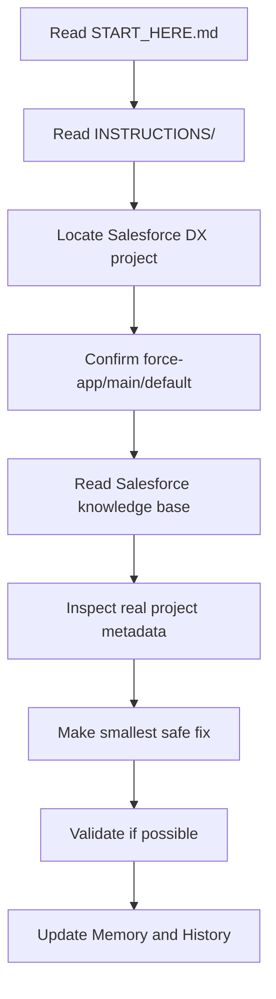

# Instructions

This folder contains the operating rules for the Codex-ready Salesforce coding engine.

Codex must read these instructions before editing real project metadata.

## Instruction Set

| File | Purpose |
| --- | --- |
| [CODEX_RULES.md](CODEX_RULES.md) | Non-negotiable rules for every Codex task. |
| [DEVELOPMENT_WORKFLOW.md](DEVELOPMENT_WORKFLOW.md) | Intake-to-result workflow for Salesforce work. |
| [SALESFORCE_PROJECT_PLACEMENT.md](SALESFORCE_PROJECT_PLACEMENT.md) | Where users place or reference the real Salesforce DX project. |
| [MEMORY_AND_HISTORY_RULES.md](MEMORY_AND_HISTORY_RULES.md) | What Codex records in Memory and History after meaningful work. |
| [OUTPUT_FORMAT_RULES.md](OUTPUT_FORMAT_RULES.md) | What Codex should return after investigation or code changes. |
| [REPO_MAP.md](REPO_MAP.md) | Clean map of the final repo structure. |

## Required Codex Flow

## Core Rules

- [ ] Read [START_HERE.md](../START_HERE.md) first.
- [ ] Locate the real Salesforce DX project before editing.
- [ ] Confirm the real `force-app/main/default` path.
- [ ] Read the relevant Salesforce knowledge base docs.
- [ ] Inspect real project metadata before editing.
- [ ] Do not guess Salesforce object, field, metadata, permission, record type, or Apex names.
- [ ] Make the smallest safe change.
- [ ] Keep work public-safe.
- [ ] Update Memory and History after meaningful work.

## Public-Safe Boundary

This repo stores instructions, prompts, checklists, examples, Memory, History, and workspace notes.

It must not contain credentials, private org data, private logs, local-only paths, or accidental real project metadata unless the repo owner intentionally chooses to publish that metadata.
