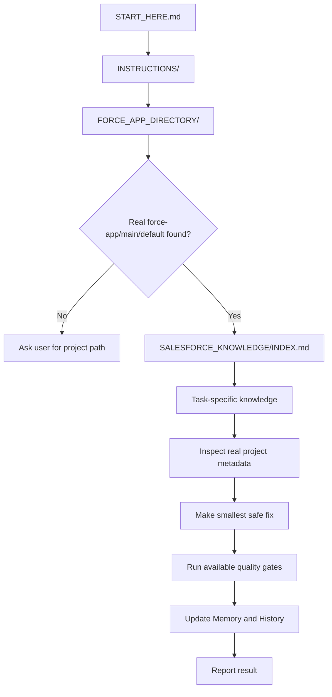

# Repo Map

This is the clean map for the Codex-ready Salesforce coding engine.

## Root Structure

```text
.
|-- README.md
|-- START_HERE.md
|-- INSTRUCTIONS/
|-- FORCE_APP_DIRECTORY/
|-- SALESFORCE_KNOWLEDGE/
|-- TOOLS/
|-- QUALITY_GATES/
|-- AUTOMATION/
|-- VENDOR_REFERENCES/
|-- MEMORY/
|-- HISTORY/
|-- WORKSPACE/
|-- WIKI_DRAFTS/
|-- .github/
|   `-- workflows/
|-- ARCHIVE/
|-- LICENSE
|-- SECURITY.md
|-- CONTRIBUTING.md
|-- CONTRIBUTING_GUIDELINES.md
|-- CODE_OF_CONDUCT.md
|-- CHANGELOG.md
|-- RELEASES.md
|-- RELEASE_NOTES_v1.0.0.md
|-- RELEASE_NOTES_v1.1.0.md
|-- RELEASE_NOTES_v1.2.0.md
|-- PUBLIC_REPO_REVIEW_CHECKLIST.md
|-- SOURCE_MAPPING.md
|-- .gitattributes
`-- .gitignore
```

## Folder Purpose

| Path | Purpose |
| --- | --- |
| `README.md` | GitHub landing page and quick setup guide. |
| `START_HERE.md` | First file Codex must read. |
| `INSTRUCTIONS/` | Required operating rules and workflow. |
| `FORCE_APP_DIRECTORY/` | Placeholder or pointer for the real Salesforce DX project. |
| `SALESFORCE_KNOWLEDGE/` | Salesforce knowledge base. |
| `TOOLS/` | Optional tooling guides for analysis, linting, testing, formatting, and external references. |
| `QUALITY_GATES/` | Validation rules Codex should run after code changes when available. |
| `AUTOMATION/` | Local public-safe validation scripts. |
| `VENDOR_REFERENCES/` | External repo references, attribution, license notes, and no-vendoring policy. |
| `MEMORY/` | Durable lessons and stable facts. |
| `HISTORY/` | Chronological records of meaningful work. |
| `WORKSPACE/` | Current audits, plans, and working notes. |
| `WIKI_DRAFTS/` | Public-safe GitHub Wiki source drafts. |
| `ARCHIVE/` | Superseded public-safe material. |

## Instruction Files

```text
INSTRUCTIONS/
|-- README.md
|-- CODEX_RULES.md
|-- DEVELOPMENT_WORKFLOW.md
|-- SALESFORCE_PROJECT_PLACEMENT.md
|-- MEMORY_AND_HISTORY_RULES.md
|-- OUTPUT_FORMAT_RULES.md
`-- REPO_MAP.md
```

| File | Purpose |
| --- | --- |
| `CODEX_RULES.md` | Non-negotiable Codex task rules. |
| `DEVELOPMENT_WORKFLOW.md` | Intake-to-result workflow. |
| `SALESFORCE_PROJECT_PLACEMENT.md` | Real project placement and external path rules. |
| `MEMORY_AND_HISTORY_RULES.md` | What gets recorded after meaningful work. |
| `OUTPUT_FORMAT_RULES.md` | Required final answer content. |
| `REPO_MAP.md` | This structure map. |

## Salesforce Knowledge Base

```text
SALESFORCE_KNOWLEDGE/
|-- README.md
|-- INDEX.md
|-- GUIDES/
|-- TOPICS/
|   |-- apex/
|   |-- aura/
|   |-- deployment/
|   |-- lwc/
|   |-- metadata/
|   |-- mobile/
|   |-- testing/
|   |-- troubleshooting/
|   `-- visualforce/
|-- PATTERNS/
|   |-- good_patterns/
|   `-- anti_patterns/
|-- PROMPTS/
|   `-- CODEX_PROMPT_PACK/
|-- CHECKLISTS/
|   `-- CODEX_ENGINE_CHECKLISTS/
|-- EXAMPLES/
|-- REFERENCE/
`-- DOCS/
```

| Path | Contents |
| --- | --- |
| `GUIDES/` | Broad guidance by Salesforce platform area. |
| `TOPICS/` | Focused technical notes by task area. |
| `PATTERNS/good_patterns/` | Reusable implementation patterns. |
| `PATTERNS/anti_patterns/` | Known patterns to avoid. |
| `PROMPTS/` | Reusable Codex prompts. |
| `CHECKLISTS/` | Preflight and review checklists. |
| `EXAMPLES/` | Public-safe Apex, LWC, and metadata examples. |
| `REFERENCE/` | Glossary, CLI reference, and discovery templates. |
| `DOCS/` | Governance, engineering principles, and public-safety policy. |

## Tooling And Quality Gates

```text
TOOLS/
|-- README.md
|-- TOOL_REGISTRY.md
|-- INSTALL_TOOLING.md
|-- SALESFORCE_CODE_ANALYZER.md
|-- LWC_JEST.md
|-- PRETTIER_APEX.md
|-- ESLINT_LWC.md
|-- LWC_MOBILE_LINT.md
`-- EXTERNAL_REFERENCE_REPOS.md

QUALITY_GATES/
|-- README.md
|-- CODE_ANALYZER_RULES.md
|-- LWC_LINT_RULES.md
|-- APEX_FORMATTING.md
|-- TESTING_GATE.md
`-- RELEASE_GATE.md

AUTOMATION/
|-- README.md
|-- local-quality-check.ps1
|-- validate-salesforce-project.ps1
|-- local-quality-check.sh
`-- validate-salesforce-project.sh

VENDOR_REFERENCES/
|-- README.md
|-- TOOL_SOURCE_MAP.md
|-- EXTERNAL_REPOS_TO_CLONE_OPTIONALLY.md
`-- LICENSE_AND_ATTRIBUTION_NOTES.md
```

| Path | Contents |
| --- | --- |
| `TOOLS/` | Optional tool guidance and install notes. |
| `QUALITY_GATES/` | Evidence gates for Codex validation. |
| `AUTOMATION/` | Local scripts that check repo safety and Salesforce DX project placement. |
| `VENDOR_REFERENCES/` | External repo source map and attribution requirements. |

## Real Salesforce DX Project

The expected real project metadata path is:

```text
force-app/main/default/
```

Recommended placement:

```text
FORCE_APP_DIRECTORY/my-project/force-app/main/default/
```

Alternative placement:

```text
FORCE_APP_DIRECTORY/force-app/main/default/
```

External projects may be documented in `FORCE_APP_DIRECTORY/README.md`.

## Codex Navigation Flow


