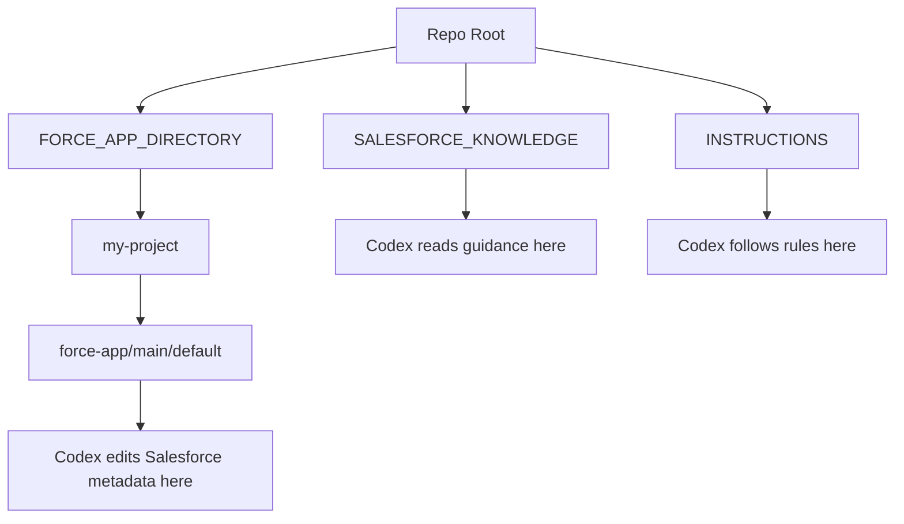

# Salesforce Project Placement

This repo is a Salesforce coding engine, not automatically the Salesforce DX project.

Users should place their real Salesforce DX project in `FORCE_APP_DIRECTORY/`, or document an external path there.

## Recommended Placement

Preferred:

```text
FORCE_APP_DIRECTORY/my-project/force-app/main/default/
```

Also valid for a single project copied directly into the placeholder:

```text
FORCE_APP_DIRECTORY/force-app/main/default/
```

Alternative:

```text
FORCE_APP_DIRECTORY/README.md
```

Use the README to document an external project path when the Salesforce DX project remains elsewhere.

## What Codex Must Locate

Codex must search for and confirm:

```text
force-app/main/default
```

before editing Salesforce metadata.

Do not edit code just because a file resembles Apex, LWC, Aura, Visualforce, or XML. Confirm it belongs to the real Salesforce DX project.

## Expected Project Markers

A real Salesforce DX project usually includes:

| Marker | Meaning |
| --- | --- |
| `sfdx-project.json` | Salesforce DX project config. |
| `force-app/main/default/` | Default deployable metadata source root. |
| `package.xml` | Optional manifest, often under `manifest/`. |
| `.forceignore` | Optional deploy/retrieve ignore file. |
| `config/project-scratch-def.json` | Optional scratch org config. |

## Search Procedure For Codex

Start with:

```powershell
rg --files FORCE_APP_DIRECTORY
rg --files -g sfdx-project.json
```

Then inspect candidate paths:

```powershell
Get-ChildItem -Path FORCE_APP_DIRECTORY -Recurse -Directory -Filter default
```

Valid target examples:

```text
FORCE_APP_DIRECTORY/my-project/force-app/main/default/classes/
FORCE_APP_DIRECTORY/my-project/force-app/main/default/lwc/
FORCE_APP_DIRECTORY/my-project/force-app/main/default/objects/
```

## External Project References

If the project is external, users should edit `FORCE_APP_DIRECTORY/README.md` and add:

```text
External Salesforce DX project:
<path to project root>

Deployable metadata root:
<path to force-app/main/default>

Target org alias:
<optional alias>
```

Codex must treat that as a pointer, not as content to publish publicly.

## What Not To Put In `FORCE_APP_DIRECTORY/`

Do not commit:

- `.sf/`
- `.sfdx/`
- auth files,
- credentials,
- tokens,
- private keys,
- deploy logs,
- retrieved private production data,
- raw debug logs with private data,
- generated coverage output,
- node modules.

## Multiple Projects

If more than one Salesforce DX project is present, Codex must not choose by guess.

Selection order:

1. User-specified path.
2. External path documented in `FORCE_APP_DIRECTORY/README.md`.
3. Only unambiguous `force-app/main/default` candidate.
4. Ask the user.

## Mermaid Placement Map



