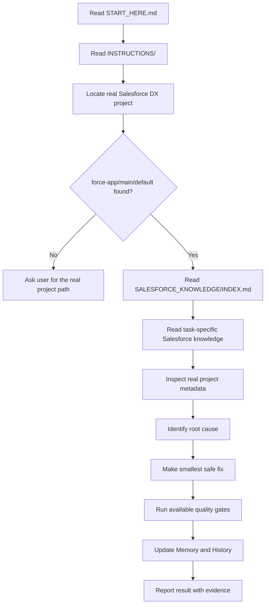

# Salesforce Codex Engine

[](https://github.com/swayerloren/salesforce-coding/releases)
[](LICENSE)
[](SALESFORCE_KNOWLEDGE/INDEX.md)
[](START_HERE.md)

A Codex-ready Salesforce coding engine for fixing, debugging, structuring, and improving a real Salesforce DX project.

Codex reads this repo for operating rules and Salesforce knowledge, then works on real project metadata under `force-app/main/default`.

Start here: [START_HERE.md](START_HERE.md)

## New User Quick Start

1. Download the latest release ZIP from the GitHub [Releases](https://github.com/swayerloren/salesforce-coding/releases) page.
2. Extract the ZIP to a normal working folder.
3. Open the extracted repo folder in VS Code with Codex available.
4. Place the real Salesforce DX project under [FORCE_APP_DIRECTORY/](FORCE_APP_DIRECTORY/) or record where the external project lives in [FORCE_APP_DIRECTORY/README.md](FORCE_APP_DIRECTORY/README.md).
5. Start Codex with: `Read START_HERE.md first, then follow the repo instructions before editing Salesforce source.`
6. Codex reads [INSTRUCTIONS/](INSTRUCTIONS/), locates the real `force-app/main/default`, then reads [SALESFORCE_KNOWLEDGE/INDEX.md](SALESFORCE_KNOWLEDGE/INDEX.md).
7. Codex reads the relevant guides, prompts, checklists, command maps, parameter maps, quality strategies, and validation flows for the task.
8. Codex inspects current project files, makes the smallest safe fix, and avoids guessed API names, invented metadata, unrelated edits, and broad refactors.
9. Codex runs or recommends available validation, reports skipped gates clearly, and updates [MEMORY/](MEMORY/) and [HISTORY/](HISTORY/) after meaningful work.

## What This Repo Is

| Area | Purpose |
| --- | --- |
| [INSTRUCTIONS/](INSTRUCTIONS/) | Required operating rules for Codex before every task. |
| [FORCE_APP_DIRECTORY/](FORCE_APP_DIRECTORY/) | Placeholder where users place or reference the real Salesforce DX project. |
| [SALESFORCE_KNOWLEDGE/](SALESFORCE_KNOWLEDGE/) | Salesforce knowledge base for Apex, LWC, Aura, Visualforce, metadata, testing, deployment, files, and mobile. |
| [SALESFORCE_KNOWLEDGE/COMMANDS/](SALESFORCE_KNOWLEDGE/COMMANDS/) | Command maps for Salesforce CLI, npm scripts, LWC tests, Apex validation, and GitHub Actions. |
| [SALESFORCE_KNOWLEDGE/PARAMETERS/](SALESFORCE_KNOWLEDGE/PARAMETERS/) | Parameter maps for Code Analyzer, LWC Jest, ESLint LWC, Prettier Apex, and local automation. |
| [SALESFORCE_KNOWLEDGE/QUALITY_STRATEGIES/](SALESFORCE_KNOWLEDGE/QUALITY_STRATEGIES/) | Task-specific quality strategies for Apex, LWC, metadata, mobile, deployment, and pull requests. |
| [SALESFORCE_KNOWLEDGE/VALIDATION_FLOWS/](SALESFORCE_KNOWLEDGE/VALIDATION_FLOWS/) | Step-by-step validation flows Codex should follow after changes. |
| [TOOLS/](TOOLS/) | Tooling guides for optional Salesforce analysis, linting, testing, formatting, and external references. |
| [QUALITY_GATES/](QUALITY_GATES/) | Validation rules Codex should run after code changes when available. |
| [AUTOMATION/](AUTOMATION/) | Local public-safe validation scripts. |
| [VENDOR_REFERENCES/](VENDOR_REFERENCES/) | External repo attribution, safe-use notes, and optional clone guidance. |
| [.github/workflows/](.github/workflows/) | Public-safe GitHub Actions for Markdown links, public-safety scanning, and optional Salesforce Code Analyzer checks. |
| [MEMORY/](MEMORY/) | Reusable lessons and stable facts Codex should remember. |
| [HISTORY/](HISTORY/) | Chronological record of meaningful Codex work. |
| [WIKI_DRAFTS/](WIKI_DRAFTS/) | Public-safe source drafts for GitHub Wiki pages. |

Use this repo as the operating layer around a real Salesforce DX project. It gives Codex the rules, checklists, prompts, and Salesforce-specific guidance it needs before making changes.

## What This Repo Is Not

- It is not a Salesforce org.
- It is not a complete Salesforce DX project by default.
- It does not include private production metadata by default.
- It does not include credentials, auth files, org secrets, customer data, or private logs.
- It should not be deployed to Salesforce as-is.
- It should not contain placeholder deployable Apex, LWC, object, layout, or metadata files in `FORCE_APP_DIRECTORY/`.

## Install

Recommended for non-developers: download the latest release ZIP, extract it, and open the extracted folder in VS Code.

For users comfortable with Git, clone the repo:

```bash
git clone <repo-url>
cd salesforce-coding
code .
```

After the repo opens, tell Codex to read [START_HERE.md](START_HERE.md) before asking it to fix Salesforce code.

## Add Your Salesforce DX Project

The real Salesforce DX project must be available before Codex edits source.

Recommended placement:

```text
FORCE_APP_DIRECTORY/my-salesforce-project/force-app/main/default/
```

Common real project metadata paths:

```text
FORCE_APP_DIRECTORY/my-salesforce-project/force-app/main/default/classes/
FORCE_APP_DIRECTORY/my-salesforce-project/force-app/main/default/lwc/
FORCE_APP_DIRECTORY/my-salesforce-project/force-app/main/default/objects/
```

Alternative: keep the Salesforce DX project outside this repo and document the external path in [FORCE_APP_DIRECTORY/README.md](FORCE_APP_DIRECTORY/README.md).

Codex must confirm the actual `force-app/main/default` path before editing.

Do not create fake deployable metadata just to satisfy this folder shape. If no real Salesforce DX project is available, Codex can still read the docs and plan work, but it must not claim project validation or edit live Salesforce source.

## Optional External References

External Salesforce repos can be cloned locally for reference, but they are not required and are not vendored into this public repo.

Use:

```powershell
powershell -NoProfile -ExecutionPolicy Bypass -File .\VENDOR_REFERENCES\clone-reference-repos.ps1
```

```bash
bash ./VENDOR_REFERENCES/clone-reference-repos.sh
```

The scripts clone into `VENDOR_REFERENCES/_external/`, which is ignored by git. Codex may inspect those local clones if present, but must not copy code blindly and must still verify the user's real `force-app/main/default` first.

## How Codex Must Operate



## Required Reading Order

| Order | Codex reads | Why |
| ---: | --- | --- |
| 1 | [START_HERE.md](START_HERE.md) | Confirms the purpose and operating flow. |
| 2 | [INSTRUCTIONS/](INSTRUCTIONS/) | Defines task rules, workflow, output, Memory, and History requirements. |
| 3 | [FORCE_APP_DIRECTORY/](FORCE_APP_DIRECTORY/) | Locates the real Salesforce DX project or external project pointer. |
| 4 | [SALESFORCE_KNOWLEDGE/INDEX.md](SALESFORCE_KNOWLEDGE/INDEX.md) | Routes Codex to task-specific Salesforce guidance. |
| 5 | [SALESFORCE_KNOWLEDGE/COMMANDS/](SALESFORCE_KNOWLEDGE/COMMANDS/), [PARAMETERS/](SALESFORCE_KNOWLEDGE/PARAMETERS/), [QUALITY_STRATEGIES/](SALESFORCE_KNOWLEDGE/QUALITY_STRATEGIES/), and [VALIDATION_FLOWS/](SALESFORCE_KNOWLEDGE/VALIDATION_FLOWS/) | Selects commands, options, validation sequence, and task-specific quality expectations. |
| 6 | [TOOLS/](TOOLS/) and [QUALITY_GATES/](QUALITY_GATES/) | Identifies optional validation tools and quality gates. |
| 7 | [MEMORY/](MEMORY/) and [HISTORY/](HISTORY/) | Reuses durable lessons and checks recent work. |

## Salesforce Knowledge Map

| Task | Read first |
| --- | --- |
| Apex, triggers, services, controllers | [Apex guide](SALESFORCE_KNOWLEDGE/GUIDES/SALESFORCE_APEX_GUIDE.md) |
| LWC templates, state, refresh, navigation | [LWC guide](SALESFORCE_KNOWLEDGE/GUIDES/SALESFORCE_LWC_GUIDE.md) |
| Aura components | [Aura guide](SALESFORCE_KNOWLEDGE/GUIDES/SALESFORCE_AURA_GUIDE.md) |
| Visualforce or PDF behavior | [Visualforce guide](SALESFORCE_KNOWLEDGE/GUIDES/SALESFORCE_VISUALFORCE_GUIDE.md) |
| Metadata, FlexiPages, actions, permissions | [Metadata guide](SALESFORCE_KNOWLEDGE/GUIDES/SALESFORCE_METADATA_GUIDE.md) |
| Record pages, activation, layouts, and quick actions | [Record page guide](SALESFORCE_KNOWLEDGE/GUIDES/SALESFORCE_RECORD_PAGE_GUIDE.md) |
| Deployments and validation | [Deployment guide](SALESFORCE_KNOWLEDGE/GUIDES/SALESFORCE_DEPLOYMENT_GUIDE.md) |
| Apex tests and coverage | [Testing guide](SALESFORCE_KNOWLEDGE/GUIDES/SALESFORCE_TESTING_GUIDE.md) |
| Salesforce Files | [File handling guide](SALESFORCE_KNOWLEDGE/GUIDES/SALESFORCE_FILE_HANDLING_GUIDE.md) |
| Mobile behavior | [Mobile guide](SALESFORCE_KNOWLEDGE/GUIDES/SALESFORCE_MOBILE_GUIDE.md) |
| Debugging failures | [Common failures and fixes](SALESFORCE_KNOWLEDGE/GUIDES/SALESFORCE_COMMON_FAILURES_AND_FIXES.md) |

For validation planning, also use [command maps](SALESFORCE_KNOWLEDGE/COMMANDS/), [parameter maps](SALESFORCE_KNOWLEDGE/PARAMETERS/), [quality strategies](SALESFORCE_KNOWLEDGE/QUALITY_STRATEGIES/), and [validation flows](SALESFORCE_KNOWLEDGE/VALIDATION_FLOWS/).

Full map: [SALESFORCE_KNOWLEDGE/INDEX.md](SALESFORCE_KNOWLEDGE/INDEX.md)

## Repo Structure

```text
.
|-- START_HERE.md
|-- README.md
|-- INSTRUCTIONS/
|-- FORCE_APP_DIRECTORY/
|-- SALESFORCE_KNOWLEDGE/
|   |-- INDEX.md
|   |-- GUIDES/
|   |-- TOPICS/
|   |-- PATTERNS/
|   |-- PROMPTS/
|   |-- CHECKLISTS/
|   |-- EXAMPLES/
|   |-- REFERENCE/
|   |-- COMMANDS/
|   |-- PARAMETERS/
|   |-- QUALITY_STRATEGIES/
|   |-- VALIDATION_FLOWS/
|   `-- DOCS/
|-- TOOLS/
|-- QUALITY_GATES/
|-- AUTOMATION/
|-- VENDOR_REFERENCES/
|-- .github/
|   `-- workflows/
|-- MEMORY/
|-- HISTORY/
|-- WORKSPACE/
|-- WIKI_DRAFTS/
`-- ARCHIVE/
```

Detailed map: [INSTRUCTIONS/REPO_MAP.md](INSTRUCTIONS/REPO_MAP.md)

## Memory And History

Codex should update Memory and History after meaningful work.

| Folder | Use for | Examples |
| --- | --- | --- |
| [MEMORY/](MEMORY/) | Durable lessons and stable facts | fix patterns, decisions, verified project patterns |
| [HISTORY/](HISTORY/) | Chronological work records | run logs, deployment notes, test results, larger changes |

Memory is reusable knowledge. History is what happened.

## Example Codex Prompts

Use these after the real Salesforce DX project is available.

| Task | Copy-ready prompt |
| --- | --- |
| Fix Apex | `Read START_HERE.md and INSTRUCTIONS/. Locate my real Salesforce DX project, confirm force-app/main/default, read the Apex and testing guidance, inspect the target Apex, callers, triggers, tests, and metadata references, then make the smallest safe fix and validate if possible.` |
| Fix LWC | `Read START_HERE.md and INSTRUCTIONS/. Locate my real Salesforce DX project, confirm force-app/main/default, read the LWC, record page, and mobile guidance, inspect the full LWC bundle and related Apex or metadata, then make the smallest safe fix and validate if possible.` |
| Fix deployment or test failure | `Read START_HERE.md and INSTRUCTIONS/. Locate my real Salesforce DX project, confirm force-app/main/default, read the deployment, testing, and common failure guidance, inspect the failing files and error output, identify root cause, make the smallest safe fix, then record validation results in History.` |
| Review metadata before deployment | `Read START_HERE.md and INSTRUCTIONS/. Locate my real Salesforce DX project, confirm force-app/main/default, read the metadata, record page, platform limitation, and release gate guidance, inspect related object, field, validation rule, record type, compact layout, FlexiPage, action, layout, permission set, profile, tab, app, report, dashboard, static resource, and package.xml files, then report deployment risks with file references.` |

Additional examples:

```text
Read START_HERE.md and INSTRUCTIONS/. Locate my real Salesforce DX project under FORCE_APP_DIRECTORY/, confirm force-app/main/default, then fix the failing LWC deployment error. Read the LWC knowledge docs before editing.
```

```text
Debug this Apex test failure. Inspect the real project metadata first, read the Apex and testing guides, identify the root cause, make the smallest safe fix, validate if possible, then update Memory and History.
```

```text
Review this metadata change before deployment. Read the metadata and record page guides, inspect related activation, assignment, permissions, object, field, layout, FlexiPage, action, record type, compact layout, and package.xml files, then report risks with file references.
```

Prompt pack: [SALESFORCE_KNOWLEDGE/PROMPTS/CODEX_PROMPT_PACK/](SALESFORCE_KNOWLEDGE/PROMPTS/CODEX_PROMPT_PACK/)

## Safety Rules

Before editing real project metadata, Codex must confirm:

- [ ] `START_HERE.md` was read.
- [ ] `INSTRUCTIONS/` was read.
- [ ] The real `force-app/main/default` folder was located.
- [ ] Relevant Salesforce knowledge was read.
- [ ] Existing real project files were inspected.
- [ ] Object, field, metadata, permission, profile, record type, and Apex names were verified.
- [ ] The planned change is the smallest safe fix.
- [ ] Available quality gates are identified and validation is planned, or a limit is clearly stated.
- [ ] Local automation and GitHub Actions results have been reviewed when available.
- [ ] Memory and History updates are needed or intentionally skipped.

## Public-Safe Repository Rules

Do not commit:

- credentials or auth files,
- tokens, private keys, authorization headers, or session data,
- org IDs, deploy IDs, or private user identifiers,
- customer data, private business details, or internal URLs,
- private screenshots or raw private debug logs,
- generated deployment artifacts,
- placeholder deployable metadata in `FORCE_APP_DIRECTORY/`,
- local optional reference clones in `VENDOR_REFERENCES/_external/`,
- temporary analysis folders such as `temp/`,
- local-only notes such as `*.local.md`.

Review [PUBLIC_REPO_REVIEW_CHECKLIST.md](PUBLIC_REPO_REVIEW_CHECKLIST.md), [SECURITY.md](SECURITY.md), and [SALESFORCE_KNOWLEDGE/DOCS/public-sanitization-policy.md](SALESFORCE_KNOWLEDGE/DOCS/public-sanitization-policy.md) before publishing.

## Key Links

| Need | Link |
| --- | --- |
| First read | [START_HERE.md](START_HERE.md) |
| Codex operating rules | [INSTRUCTIONS/](INSTRUCTIONS/) |
| Salesforce knowledge base | [SALESFORCE_KNOWLEDGE/INDEX.md](SALESFORCE_KNOWLEDGE/INDEX.md) |
| Tooling guides | [TOOLS/](TOOLS/) |
| Quality gates | [QUALITY_GATES/](QUALITY_GATES/) |
| Local automation | [AUTOMATION/](AUTOMATION/) |
| External references | [VENDOR_REFERENCES/](VENDOR_REFERENCES/) |
| GitHub Actions | [.github/workflows/](.github/workflows/) |
| Real project placement | [FORCE_APP_DIRECTORY/](FORCE_APP_DIRECTORY/) |
| Memory | [MEMORY/](MEMORY/) |
| History | [HISTORY/](HISTORY/) |
| Wiki drafts | [WIKI_DRAFTS/](WIKI_DRAFTS/) |
| Latest release notes | [RELEASE_NOTES_v1.3.0.md](RELEASE_NOTES_v1.3.0.md) |

## License

MIT. See [LICENSE](LICENSE).
