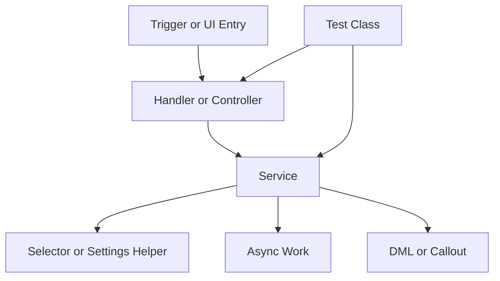

# Apex Fixing Guide

Use this page for Apex classes, triggers, services, controllers, queueables, batches, schedulers, invocable methods, and Apex tests.

## Required Reads

| Read | Why |
| --- | --- |
| `SALESFORCE_KNOWLEDGE/GUIDES/SALESFORCE_APEX_GUIDE.md` | Apex safety, SOQL, DML, async, and sharing guidance. |
| `SALESFORCE_KNOWLEDGE/GUIDES/SALESFORCE_TESTING_GUIDE.md` | Test design and deployment coverage guidance. |
| `SALESFORCE_KNOWLEDGE/GUIDES/SALESFORCE_COMMON_FAILURES_AND_FIXES.md` | Repeated Salesforce failure patterns. |
| `SALESFORCE_KNOWLEDGE/TOPICS/apex/` | Focused Apex topics. |
| `SALESFORCE_KNOWLEDGE/CHECKLISTS/before-apex.md` | Preflight checklist. |

## Inspection Checklist

- [ ] Locate the real `force-app/main/default`.
- [ ] Inspect the target `.cls` and `.cls-meta.xml`.
- [ ] Inspect related tests.
- [ ] Inspect callers: triggers, controllers, services, LWC imports, Aura, Visualforce, invocable usage, and scheduled jobs.
- [ ] Inspect referenced object and field metadata.
- [ ] Search for method usage before changing signatures.
- [ ] Identify required dependencies versus optional integrations.
- [ ] Confirm sharing mode and CRUD/FLS expectations.

## Common Apex Layers



## Safe Fix Rules

| Rule | Reason |
| --- | --- |
| Keep triggers thin. | Business logic belongs in handlers and services. |
| Bulkify every path. | UI, API, import, Flow, and tests can all trigger bulk execution. |
| Use static SOQL when possible. | Dynamic SOQL needs describe validation and whitelisting. |
| Do not guess API names. | Metadata names must be verified in source. |
| Keep required behavior direct. | Required logic should not silently no-op through optional dynamic dispatch. |
| Add or update focused tests. | Apex fixes need evidence and deployment support. |

## Validation

Useful validation commands:

```powershell
sf apex run test --target-org <alias> --test-level RunSpecifiedTests --tests <TestClass> --result-format human --wait 30
```

```powershell
sf project deploy start --target-org <alias> --dry-run --source-dir force-app/main/default/classes/<ClassName>.cls --test-level RunSpecifiedTests --tests <TestClass>
```

Only run real deploys after a successful dry run and only when the user requested deployment.

