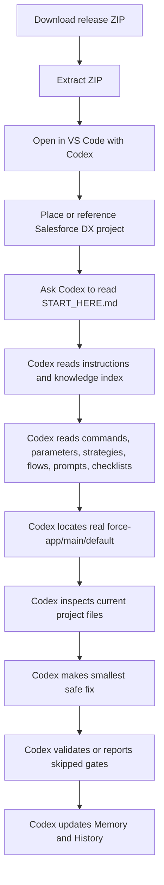

# Salesforce Codex Engine Wiki

Welcome to the wiki source for the Codex-ready Salesforce coding engine.

This repo helps users pair Codex with a real Salesforce DX project. Users place or reference the project in `FORCE_APP_DIRECTORY/`, then Codex reads instructions and the Salesforce knowledge base before editing real project metadata under `force-app/main/default`.

## What This Repo Provides

| Capability | Purpose |
| --- | --- |
| Codex rules | A repeatable workflow for every Salesforce task. |
| Salesforce knowledge base | Guidance for Apex, LWC, Aura, Visualforce, metadata, tests, deployment, Files, and mobile. |
| Project placement | A clear place to add or reference the real Salesforce DX project. |
| Tooling guides | Optional Salesforce Code Analyzer, LWC Jest, LWC ESLint, mobile lint, and Apex formatting guidance. |
| Quality gates | Validation rules Codex can run or recommend after real source changes. |
| Automation scripts | Local public-safe project discovery, safety, and quality checks. |
| Vendor references | Optional local clone guidance for public Salesforce reference repos without vendoring them. |
| Memory | Reusable lessons and stable project facts. |
| History | Chronological work, test, deployment, and change records. |
| Public-safe examples | Generic examples without private org metadata. |

## New User Path

1. Download the latest release ZIP from GitHub Releases.
2. Extract the ZIP.
3. Open the extracted folder in VS Code with Codex.
4. Place or reference the real Salesforce DX project.
5. Tell Codex to read `START_HERE.md`.
6. Codex reads instructions, knowledge, commands, parameters, quality strategies, validation flows, prompts, and checklists.
7. Codex inspects current project files and makes narrow fixes.
8. Codex runs or recommends validation and reports skipped gates clearly.
9. Codex updates Memory and History after meaningful work.

## Core Workflow

## Wiki Pages

| Page | Use it for |
| --- | --- |
| [Installation Guide](Installation-Guide.md) | Downloading and opening the repo. |
| [How Codex Should Use This Repo](How-Codex-Should-Use-This-Repo.md) | Required startup and task workflow. |
| [Recommended Project Structure](Recommended-Project-Structure.md) | Where to place or reference the real Salesforce DX project. |
| [Codex Start Prompt](Codex-Start-Prompt.md) | Copy-ready prompts for starting Codex correctly. |
| [Apex Fixing Guide](Apex-Fixing-Guide.md) | Apex, triggers, services, controllers, and tests. |
| [LWC Fixing Guide](LWC-Fixing-Guide.md) | LWC bundles, metadata, controllers, styling, and mobile behavior. |
| [Aura and Visualforce Guide](Aura-and-Visualforce-Guide.md) | Aura boundaries and Visualforce/PDF work. |
| [Metadata and Record Page Guide](Metadata-and-Record-Page-Guide.md) | Objects, fields, FlexiPages, actions, layouts, permissions, and tabs. |
| [Testing and Deployment Guide](Testing-and-Deployment-Guide.md) | Validation, tests, deploy dry runs, and deployment logs. |
| [Common Failures Codex Must Check](Common-Failures-Codex-Must-Check.md) | Failure patterns Codex should check before fixing. |
| [Memory and History System](Memory-and-History-System.md) | What Codex records after meaningful work. |
| [Folder Map](Folder-Map.md) | Repo structure, tooling, quality gates, automation, vendor references, and folder responsibilities. |
| [Prompt Library](Prompt-Library.md) | Task prompts users can adapt. |
| [Contributing and Safety Rules](Contributing-and-Safety-Rules.md) | Public-safe contribution rules. |

## Common Starting Points

| Need | Start with |
| --- | --- |
| First Codex run | [Codex Start Prompt](Codex-Start-Prompt.md) |
| Apex fix | [Apex Fixing Guide](Apex-Fixing-Guide.md) |
| LWC fix | [LWC Fixing Guide](LWC-Fixing-Guide.md) |
| Deployment or test failure | [Testing and Deployment Guide](Testing-and-Deployment-Guide.md) and [Common Failures Codex Must Check](Common-Failures-Codex-Must-Check.md) |
| Metadata or record page change | [Metadata and Record Page Guide](Metadata-and-Record-Page-Guide.md) |
| Memory and History behavior | [Memory and History System](Memory-and-History-System.md) |

## First Rule

Codex must not assume this helper repo is the Salesforce DX project.

Codex must locate the user's real `force-app/main/default` folder before editing Apex, LWC, Aura, Visualforce, metadata, tests, or deployment files.
