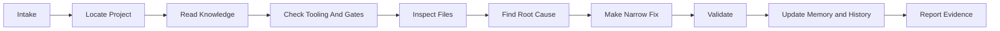

# How Codex Should Use This Repo

Codex should treat this repo as an operating layer and knowledge base.

It should not treat this repo as the real Salesforce DX project unless the user has placed a real Salesforce DX project under `FORCE_APP_DIRECTORY/`.

## Required Reading Order

| Order | Codex reads | Reason |
| ---: | --- | --- |
| 1 | `START_HERE.md` | Understands the repo purpose and required startup flow. |
| 2 | `INSTRUCTIONS/` | Loads mandatory workflow, project placement, memory/history, and output rules. |
| 3 | `FORCE_APP_DIRECTORY/README.md` | Finds where the real Salesforce DX project is placed or referenced. |
| 4 | `SALESFORCE_KNOWLEDGE/INDEX.md` | Chooses the correct Salesforce guides for the task. |
| 5 | Relevant `SALESFORCE_KNOWLEDGE/` files | Reads task-specific platform guidance before editing. |
| 6 | `TOOLS/` and `QUALITY_GATES/` | Finds optional validation tools and evidence gates. |
| 7 | `MEMORY/` and `HISTORY/` | Checks durable lessons and recent work. |

## Task Workflow

## Codex Must

- [ ] Locate the real `force-app/main/default`.
- [ ] Inspect existing files before editing.
- [ ] Verify object, field, metadata, Apex, permission, profile, and record type names.
- [ ] Make the smallest safe change.
- [ ] Avoid unrelated edits.
- [ ] Preserve Salesforce DX structure.
- [ ] Use available quality gates from `TOOLS/`, `QUALITY_GATES/`, `AUTOMATION/`, and `.github/workflows/` when practical.
- [ ] Report any skipped validation clearly.
- [ ] Update `MEMORY/` and `HISTORY/` after meaningful work.

## Codex Must Not

- Guess API names.
- Edit examples as if they were live source.
- Create placeholder deployable Apex, LWC, object, layout, or metadata files.
- Deploy documentation folders.
- Vendor optional external reference repos into the public repo.
- Hide required business behavior behind optional dynamic logic.
- Claim success without evidence.

## Source Authority

The real Salesforce DX source is authoritative for current behavior.

Docs, memory, and history are useful context, but Codex must re-check the current source before changing live metadata.
