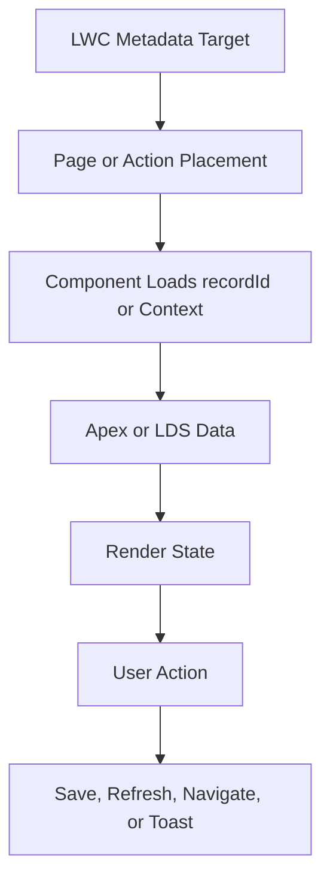

# LWC Fixing Guide

Use this page for Lightning Web Components, record actions, record-page widgets, workspace components, community components, mobile behavior, and Apex-backed UI.

## Required Reads

| Read | Why |
| --- | --- |
| `SALESFORCE_KNOWLEDGE/GUIDES/SALESFORCE_LWC_GUIDE.md` | LWC template, state, refresh, navigation, and styling rules. |
| `SALESFORCE_KNOWLEDGE/GUIDES/SALESFORCE_RECORD_PAGE_GUIDE.md` | Record page placement and action visibility. |
| `SALESFORCE_KNOWLEDGE/GUIDES/SALESFORCE_MOBILE_GUIDE.md` | Salesforce mobile runtime constraints. |
| `SALESFORCE_KNOWLEDGE/TOPICS/lwc/` | Focused LWC troubleshooting. |
| `SALESFORCE_KNOWLEDGE/CHECKLISTS/CODEX_ENGINE_CHECKLISTS/BEFORE_EDITING_LWC.md` | LWC preflight checklist. |
| `TOOLS/LWC_JEST.md` | LWC unit test guidance when Jest is available. |
| `TOOLS/ESLINT_LWC.md` | LWC lint guidance. |
| `TOOLS/LWC_MOBILE_LINT.md` | Mobile/offline lint guidance when relevant. |
| `QUALITY_GATES/LWC_LINT_RULES.md` | LWC lint gate and skipped-tool behavior. |
| `QUALITY_GATES/TESTING_GATE.md` | Test evidence expectations. |

## Inspect The Whole Bundle

```text
force-app/main/default/lwc/<bundleName>/
  <bundleName>.html
  <bundleName>.js
  <bundleName>.css
  <bundleName>.js-meta.xml
```

Also inspect:

- imported Apex controller methods,
- parent and child components,
- `lightning/uiRecordApi` usage,
- navigation and toast usage,
- form factor support,
- object restrictions in `.js-meta.xml`,
- related FlexiPages and quick actions,
- Jest tests if present.

## Common LWC Failures

| Failure | Codex should check |
| --- | --- |
| Template compile error | Move expressions into getters. |
| Record action missing | Check `.js-meta.xml`, quick action metadata, FlexiPage action placement, permissions, and mobile support. |
| Data does not refresh | Check `refreshApex`, LDS notifications, event bubbling, and parent cache state. |
| Apex call fails | Check method signature, DTO shape, sharing, CRUD/FLS, and test coverage. |
| Mobile layout breaks | Check form factors, viewport constraints, modals, scrolling, and tap targets. |
| Styling disappears in dark mode | Use theme-safe tokens and verify contrast. |

## UI Flow



## Safe Fix Rules

- Keep templates declarative.
- Put computed state in JavaScript getters.
- Do not hardcode object or field names without verifying metadata.
- Do not change public `@api` contracts without checking parents.
- Keep mobile behavior in scope for record-page and action components.
- Avoid broad CSS rewrites unless the task is specifically design-focused.
