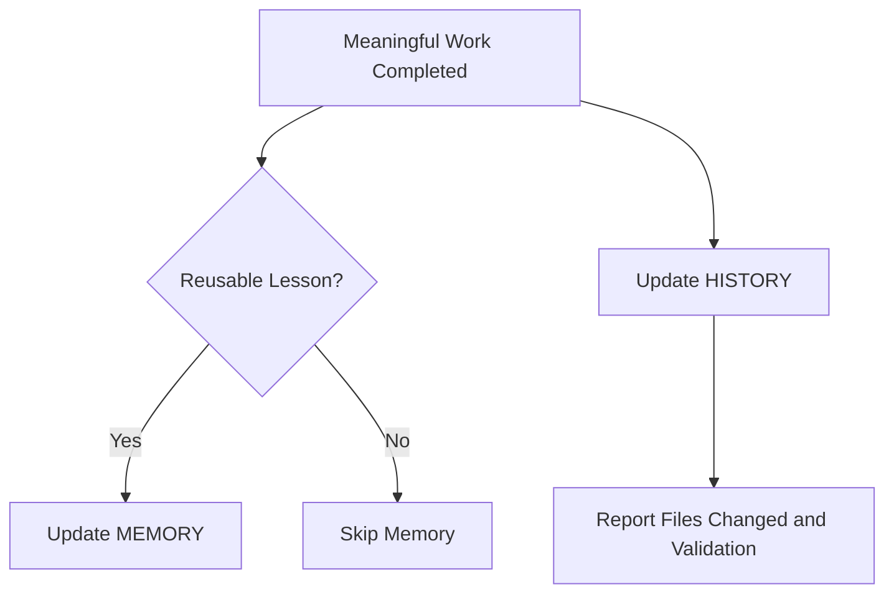

# Memory And History System

The repo separates reusable knowledge from chronological records.

## Difference

| Area | Purpose | Example |
| --- | --- | --- |
| `MEMORY/` | Reusable lessons Codex should remember. | A fix pattern, failure prevention rule, verified object naming convention, or architecture decision. |
| `HISTORY/` | Chronological record of what Codex did. | A task log, deployment result, test result, or completed change summary. |

## Memory Files

| File | Tracks |
| --- | --- |
| `MEMORY/FIX_HISTORY.md` | Reusable fix patterns. |
| `MEMORY/FAILURE_HISTORY.md` | Failed deploys, failed tests, broken behavior, root causes, and prevention rules. |
| `MEMORY/DECISION_LOG.md` | Architecture and workflow decisions. |
| `MEMORY/PROJECT_NOTES.md` | Stable project notes. |
| `MEMORY/KNOWN_ORG_PATTERNS.md` | Verified project-specific Salesforce object, field, and folder patterns. |
| `MEMORY/PROJECT_MEMORY.md` | General durable repo facts. |

## History Files

| File | Tracks |
| --- | --- |
| `HISTORY/CODEX_RUN_LOG.md` | Codex task runs. |
| `HISTORY/DEPLOYMENT_LOG.md` | Deployment and validation commands and results. |
| `HISTORY/TEST_RESULTS_LOG.md` | Apex test commands and results. |
| `HISTORY/CHANGE_ARCHIVE.md` | Larger completed changes. |
| `HISTORY/TASK_HISTORY.md` | Task summaries. |

## Update Flow

## Codex Should Update After

- code changes,
- metadata changes,
- documentation structure changes,
- debugging conclusions,
- validation discoveries,
- deployment attempts,
- test runs,
- fixes that future sessions should remember.

## Safety Rules

- Do not store credentials.
- Do not store private customer data.
- Do not store raw private debug logs.
- Do not store org IDs or deploy IDs in public docs.
- Use placeholders and generic summaries when needed.

