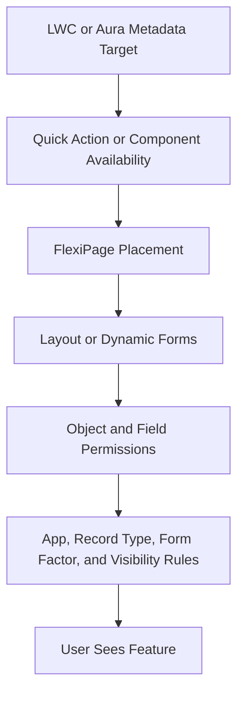

# Metadata And Record Page Guide

Use this page for object metadata, fields, layouts, FlexiPages, tabs, actions, permission sets, profiles, custom metadata, and record-page behavior.

## Required Reads

| Read | Why |
| --- | --- |
| `SALESFORCE_KNOWLEDGE/GUIDES/SALESFORCE_METADATA_GUIDE.md` | Metadata structure and deployment safety. |
| `SALESFORCE_KNOWLEDGE/GUIDES/SALESFORCE_RECORD_PAGE_GUIDE.md` | Record page and action activation behavior. |
| `SALESFORCE_KNOWLEDGE/TOPICS/metadata/` | Focused metadata notes. |
| `SALESFORCE_KNOWLEDGE/CHECKLISTS/metadata-deploy.md` | Metadata deployment checklist. |
| `SALESFORCE_KNOWLEDGE/CHECKLISTS/before-record-page-ui-change.md` | Record-page UI checklist. |

## Record Page Activation Chain

## Metadata Inspection Checklist

- [ ] Locate the real `force-app/main/default`.
- [ ] Verify the object API name in `objects/`.
- [ ] Verify field API names in object field metadata.
- [ ] Search Apex, LWC, Aura, Visualforce, Flow, layouts, and FlexiPages for references.
- [ ] Check permission sets before assuming access.
- [ ] Check record types if behavior depends on them.
- [ ] Check FlexiPage visibility rules and form factors.
- [ ] Check action metadata and page placement.
- [ ] Avoid profile churn unless the task requires it.

## Common Metadata Paths

| Metadata | Path |
| --- | --- |
| Objects and fields | `force-app/main/default/objects/` |
| FlexiPages | `force-app/main/default/flexipages/` |
| Layouts | `force-app/main/default/layouts/` |
| Permission sets | `force-app/main/default/permissionsets/` |
| Tabs | `force-app/main/default/tabs/` |
| Custom metadata | `force-app/main/default/customMetadata/` |
| Named credentials | `force-app/main/default/namedCredentials/` |
| External credentials | `force-app/main/default/externalCredentials/` |

## Safe Fix Rules

- Do not guess metadata names.
- Keep deploy scope narrow.
- Treat layouts, FlexiPages, app pages, profiles, and permission metadata as high-blast-radius changes.
- Confirm visibility with source evidence.
- Validate with a dry run when possible.

