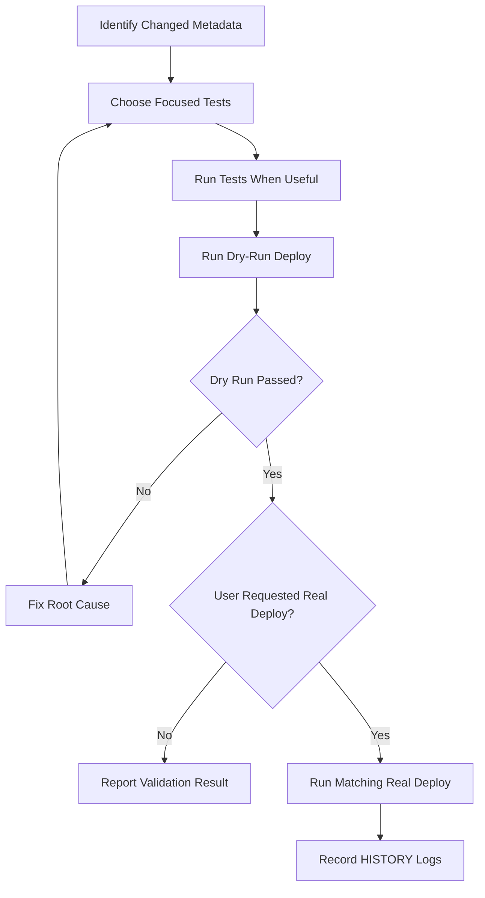

# Testing And Deployment Guide

Use this page before running Apex tests, deployment validation, or real deployments.

## Required Reads

| Read | Why |
| --- | --- |
| `SALESFORCE_KNOWLEDGE/GUIDES/SALESFORCE_TESTING_GUIDE.md` | Test design, callout mocks, async, files, and coverage strategy. |
| `SALESFORCE_KNOWLEDGE/GUIDES/SALESFORCE_DEPLOYMENT_GUIDE.md` | Deployment rules, test levels, and CLI pitfalls. |
| `SALESFORCE_KNOWLEDGE/TOPICS/deployment/` | Narrow deploy and test-selection guidance. |
| `SALESFORCE_KNOWLEDGE/CHECKLISTS/CODEX_ENGINE_CHECKLISTS/BEFORE_DEPLOYMENT.md` | Deployment preflight checklist. |
| `QUALITY_GATES/TESTING_GATE.md` | Test evidence expectations. |
| `QUALITY_GATES/RELEASE_GATE.md` | Release and deployment safety checks. |

## Deployment Flow



## Narrow Deploy Command

```powershell
sf project deploy start --target-org <alias> --dry-run --source-dir force-app/main/default/classes/<ClassName>.cls --test-level RunSpecifiedTests --tests <TestClass>
```

Run the real deploy only after the dry run passes and the user wants deployment:

```powershell
sf project deploy start --target-org <alias> --source-dir force-app/main/default/classes/<ClassName>.cls --test-level RunSpecifiedTests --tests <TestClass>
```

## Apex Test Command

```powershell
sf apex run test --target-org <alias> --test-level RunSpecifiedTests --tests <TestClass> --result-format human --wait 30
```

## Deployment Checklist

- [ ] Confirm exact changed metadata files.
- [ ] Remove unrelated source from deploy scope.
- [ ] Exclude docs, memory, history, workspace notes, and wiki drafts.
- [ ] Identify tests that actually cover the changed behavior.
- [ ] Run focused tests when useful.
- [ ] Run dry-run deployment first.
- [ ] Do not use destructive flags unless explicitly requested.
- [ ] Record command and result in `HISTORY/DEPLOYMENT_LOG.md`.
- [ ] Record test command and result in `HISTORY/TEST_RESULTS_LOG.md`.

## Important Limits

- Passing tests do not always mean deployable coverage is sufficient.
- `RunSpecifiedTests` coverage is package-specific.
- Broad `RunLocalTests` can be useful but may expose unrelated unstable tests.
- Docs-only tasks should not trigger deployment.
